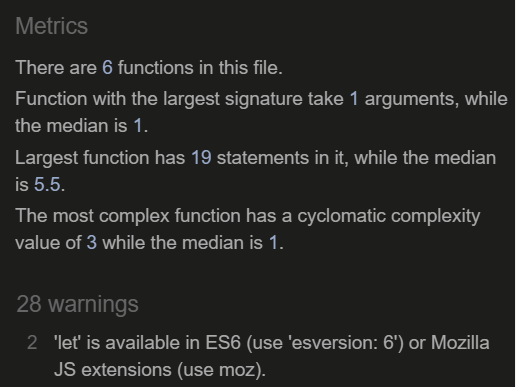

# Weather-project
>Weather-project is a web application that enables users all over the world to check the current weather of a particular city by typying the name of the city and clicking on search.
View the live web application [here] (https://olena-olkhovyk.github.io/Weather-project/)

## Features

### Existion Features
* Input field
   * The input field of the web application allows users to type in a city they want to search.
   * This field is validated and therefire cannot be submited empty or with an inappropriate data.
   * It has a placeholder text that further informs the user exactly where and what to type in.
   * It also features a hover effect that tells the user beforehand that they are on the field.

 

* Search button
   * Button allows users to submit the typed in city in order for them to get the weather of that city displayed.

* Current weather display section
   * This section of the application displays the typed in city, the current date and its corresponding weather description, weather description icon, temperature, pressure, humidity and wind speed.
   * In order not to display emptyness or unreal data, it is by default set to the city of Kyiv and will change whenever another city is keyed in.

* Temperature unit conversion
   * This part of the web application allows the user to convert temperature units from the default celsius unit to fahrenheit and viceversa just by clicking on the desired unit.
   * This helps the user to save the time of trying to manually convert units.

## Design

### Wireframes
 
Desktop version
 

 
Tablet Version
 

 
Phone Version
 

## Testing

### Responsiveness

The web application was tested to ensure responsiveness on screen sizes of 320px and above as defined in [WCAG 2.1 Reflow criteria for responsive design](https://www.w3.org/WAI/WCAG21/Understanding/reflow.html#top) on Safari, Chrome, Edge, Firefox and Opera browsers.

Steps to test:

1. Open browser and navigate to [Weather-project](https://olena-olkhovyk.github.io/Weather-project/)
2. Open the developer tools by right clicking or tapping the F12 key and click on inspect.
3. Set to responsive and decrease width to 320px
4. Set the zoom to 50%
5. Click and drag the responsive window to maximum width

* Expected

The web application is responsive on all screen sizes and no icons or elements are pixelated or stretched. 
No horizontal scroll is present. No elements overlap.

* Actual

The web application works exactly as expected.

The web application was opened on the following devices and no responsive issues were found;

- Huawei mipad 10
- Iphone 10
- Iphone 12 Xs max
- Iphone 12
- Iphone 13
- Iphone 6S plus
- Xiomi Redme 11 pro
- Samsung A 12
- Samsung Galaxy 20
- Samsung Galaxy Tab S7
- Infinix Hot 10
- Infinix Hot 12
- Asus Sonicmaster
- Hp EliteBook 8440p
- Hp laptop 14s
- Mcbook Retina

### Accessibility

[Wave Accessibility](https://wave.webaim.org/report#/https://olena-olkhovyk.github.io/Weather-project/) tool was used throughout the development process and for the final testing of the deployed web application to test for aid accessibility.

The test was aimed at ensuring the following criteria were met:

- All forms have associated labels or aria-labels so that this is read out on a screen reader to users who tab to form inputs.
- Color contrasts meet a minimum ratio as specified in [WCAG 2.1 Contrast Guidelines](https://www.w3.org/WAI/WCAG21/Understanding/ contrast-minimum.html)
- Heading levels are not missed or skipped to ensure the importance of content is relayed correctly to the end user.
- All content is contained within landmarks to ensure ease of use for assistive technology.
- All non-textual content had alternative text or titles so that descriptions can be read out to screen readers.
- HTML page lang attribute has been set.
- Aria properties have been implemented correctly.
- WCAG 2.1 Coding best practices are well followed.

### Lighthouse Testing

### Functional Testing

**Form Testing**

The form on the web application was tested to ensure it functioned as expected. Both correct data and incorrect data as well as an empty field submission were tested. 
The following test scenarios were covered:

* Scenario One - Correct Input data;

Steps to test:

1. Navigate to [Weather-project](https://olena-olkhovyk.github.io/Weather-project/)
2. Type in a valid city name:
3. Click on the "search" button.
4. The current weather condition of the particular searched city is fully displayed on the central part of the web application with the corresponding city name.

Expected:

Form submits with no warnings or errors.

Actual:

The web application behaved as expected with no errors or warnings.

* Scenario Two - Submitting an empty Field;

Steps to test:

1. Navigate to [Weather-project](https://olena-olkhovyk.github.io/Weather-project/)
2. Leave the input field empty:
3. Click on the "search" button.
4. There is a (please fill out this field) notification.

Expected:

The form does not submit but prompts the user to fill out the field.

Actual:

The web application behaved as expected, the error alert message was displayed and the form did not submit.

**Celsius and Fahrenheit Conversion**

The celsius and fahrenheit units conversion were also tested to ensure it did the right conversion.

Steps to test:

1. Navigate to [Weather-project](https://olena-olkhovyk.github.io/Weather-project/)
2. Click or tap on the fahrenheit link.
3. The unit converts to fahrenheit correctly.
4. '°F' turns the same color as the temperature digit to highlight selected unit.
5. Click or tap the celsius link.
6. The unit returns to its default celsius unit and color.

Expected:

Celsius converts smoothly and correctly into highlighted fahrenheit upon a click or tap. Fahrenheit converts back to the default celsius unit upon a click or tap.

Actual:

The web application behaved as expected with no errors or warnings.

### Validator Testing

* HTML
   - No errors were returned when passing through the official W3C validator

* CSS
   - No errors were returned when passing through the official Jigsaw validator

* Javascript
   - No errors were returned when passing through the official JSHint validator
   - However, a warning shows that 'let' is available in ES6 or Mozilla JS extensions 

